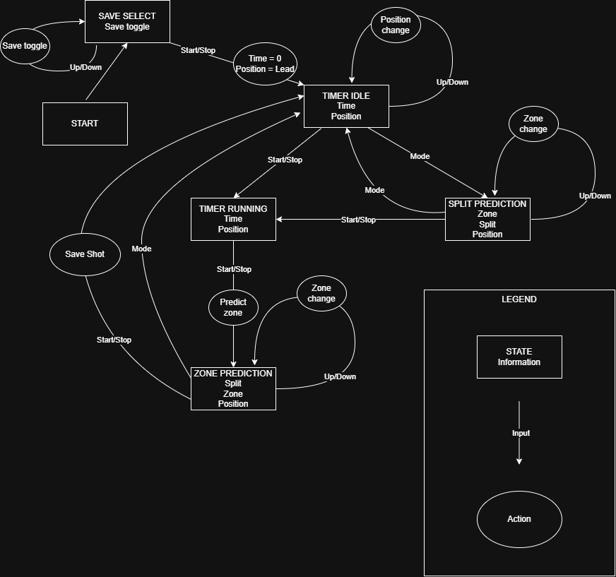

# SplitTime

SplitTime is a stopwatch designed to simply shot zone prediction for the sport of curling. It records shot split and resulting zone per-player. For each shot, if there is sufficient data, an updating per-player linear regression model will predict the resulting zone. The inverse is also possible; for a given zone, a split time is predicted per-player based on the same model. The R^2 of the model can be used as a percentage indicator of model fit.

## Project layout

- The legacy folder contains the original version of the project and is kept for reference.
- New development should be done at the root level, where the current source files, headers, and tests are located.

## Build with Make

The Makefile provides a simple way to build and test the project:

- make test builds the test executable into bin/test.
- make arduino_project copies source files into flat folder arduino_project/SplitTime
- make clean removes the generated files from the bin directory.

## State diagram

The image below shows the state diagram for the project. It describes the states, transitions, and actions used by the application.

The editable source for this diagram is available in [state_diagram/SplitTime.drawio.xml](state_diagram/SplitTime.drawio.xml).

